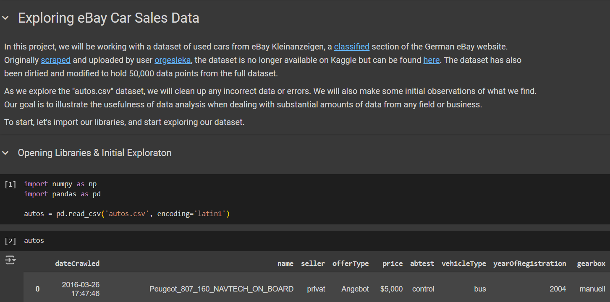

# Exploring eBay Car Sales
In this project, we will be working with a dataset of used cars from eBay Kleinanzeigen, a classified section of the German eBay website. Throughout the project, we will be exploring, cleaning, and forming some initial analysis of our dataset. Our goal is to illustrate the usefulness of data analysis when dealing with substantial amounts of data from any field or business.

View this project live on Google Colab [here](https://colab.research.google.com/drive/1l3BvpB_euhmxgGMVKatIDw_OrWpCLd71?usp=sharing).
